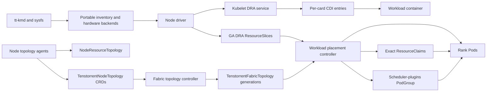
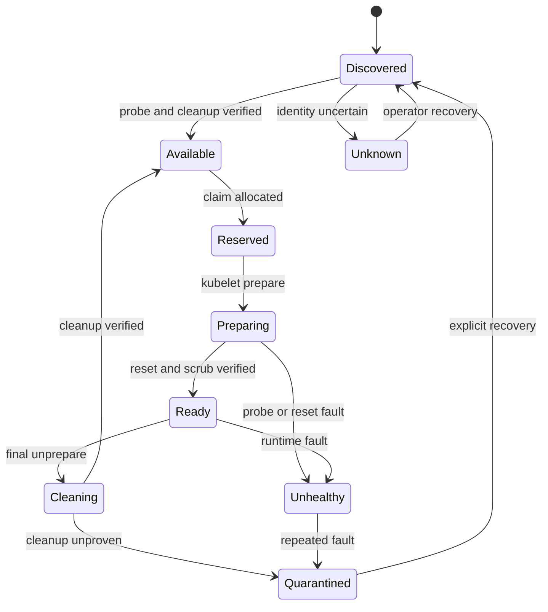

# Production-Readiness Roadmap

This is the gated execution plan for turning the current Tenstorrent DRA
scaffold into a production-engineered Kubernetes application. It contains no
calendar estimates: a stage advances only when its evidence satisfies the
blocking exit gate.

The v1.0 target is **simulator GA**: Kubernetes v1.34 and current-stable
qualification, exclusive whole-card allocation, enforced scale-out topology,
Helm installation, and signed multi-architecture OCI artifacts. Compatible
physical Linux and `tt-kmd` systems are an architectural target, but physical
Wormhole or Blackhole certification is not a v1.0 claim.

## How to use this roadmap

- [ ] Complete stages in order unless a later item is explicitly being explored
  behind a disabled feature gate.
- [ ] Keep implementation items unchecked until their code, documentation, and
  test evidence are merged.
- [ ] Store exit-gate evidence in CI and, for releases, in a versioned release
  evidence report.
- [ ] Treat every exit gate as blocking. A waived gate requires a documented,
  time-bounded exception accepted by the maintainers and may not weaken the
  v1.0 GA gate.
- [ ] Revalidate Kubernetes v1.34 and current stable independently; success on
  one does not imply success on the other.

## 1. Mission, definitions, and current baseline

### Mission

Build the hardware-software control plane that lets scale-out HPC and ML jobs
request healthy Tenstorrent cards by class and validated interconnect topology,
then receive only their allocated devices with cleanup proven between tenants.
Cluster-scale placement, isolation, and health take priority over sub-card
sharing.

### Release definitions

| Term | Meaning |
| --- | --- |
| Simulator GA | The v1.0 functionality and resilience gates pass with the QEMU `ttsim` bridge, real simulated character-device injection, synthetic scale-out fixtures, and the supported Kubernetes/runtime matrix. |
| Physical-hardware certified | A separate qualification claim backed by named Wormhole/Blackhole cards, firmware and KMD combinations, destructive reset tests, performance results, and long-running physical-hardware evidence. This is excluded from v1.0. |
| Whole card | The smallest v1.0 allocatable unit. It is exclusively owned by one allocated claim and is never divided into consumable capacity, Tensix groups, or SRAM regions. |
| Current stable | The latest stable Kubernetes minor selected and pinned when a CI or release run begins. The compatibility matrix records the exact patch version. |

### Current assets

- [x] Typed `resource.k8s.io/v1` DeviceClass, ResourceSlice, and ResourceClaim
  builders under `src/internal/dra/`, with generated reference manifests.
- [x] Four supported DeviceClasses:
  `tenstorrent-wormhole-n150`, `tenstorrent-wormhole-n300`,
  `tenstorrent-blackhole-p100`, and `tenstorrent-blackhole-p150`.
- [x] Linux character-device discovery with major/minor extraction.
- [x] Unit tests and generated-manifest consistency tests.
- [x] QEMU `ttsim`, `tt-kmd`, Kubernetes-in-kind, real device-visibility, and
  synthetic sysfs/workload validation assets under `test/vm/`.

### Current gaps

- [ ] No Kubernetes client, informer, or live ResourceSlice reconciler.
- [ ] No kubelet DRA gRPC service or plugin registration.
- [ ] No CDI device injection or per-claim device exposure.
- [ ] No persistent prepare/unprepare allocation lifecycle.
- [ ] No hardware reset, scrub, health, or quarantine janitor.
- [ ] No topology controller, public topology API, or hard placement enforcement.
- [ ] No production container image or Helm chart, release process, or
  operational runbooks; Stage 0 CI and governance scaffolding is now present.

### Target architecture

The first path makes locally observed devices allocatable and injects only the
allocated character device. The second converts observed topology into a
validated graph and uses it to create exact claims and gang-scheduled Pods;
publishing topology metadata alone is not considered topology enforcement.

## 2. Architectural guardrails

These decisions are locked for the v1.0 line. Changing one requires an
architecture decision record (ADR), compatibility analysis, and roadmap update.

- [ ] Keep the DRA driver name `dra.tenstorrent.com`.
- [ ] Set Kubernetes v1.34 as the minimum and also test current stable.
- [ ] Require only GA DRA behavior for baseline compatibility. Do not use
  consumable capacity, partitionable devices, device taints, or other alpha or
  non-baseline features in v1.0 behavior.
- [ ] Allocate whole cards exclusively; defer Tensix-core and SRAM-region
  sharing.
- [ ] Use public card tables only to inform DeviceClasses. Never manufacture
  live availability or missing capacity from reference specifications.
- [ ] Derive live state only from configurable Tenstorrent sysfs, PCI sysfs,
  `tt-kmd`, topology observations, and Kubernetes allocation state.
- [ ] Keep `/home/ubuntu`, QEMU profiles, SSH ports, simulator libraries, and
  bridge-specific behavior out of production packages. QEMU-specific assets
  stay under `test/vm/`.
- [ ] Make Linux host paths configurable through CLI flags and Helm values.
- [ ] Build OCI images for `linux/amd64` and `linux/arm64`.
- [ ] Support CDI-compliant containerd and CRI-O. Docker and kind remain a
  development and qualification route, not a production runtime contract.
- [ ] Put hardware operations behind versioned interfaces shared by simulator
  and physical KMD backends.
- [ ] Fail closed: uncertain identity, health, cleanup, or ownership removes a
  device from availability.
- [ ] Leave temperature, power, and workload telemetry in
  `tenstorrent-metrics-exporter`; this repository exports driver lifecycle and
  control-plane metrics only.
- [ ] License the project under Apache-2.0, maintain dependency notices, and run
  automated license scanning.

## Stage 0 — Repository and engineering baseline

### Prerequisites

- [ ] Preserve and validate the existing QEMU launcher regression fix.
- [ ] Confirm the supported host-versus-VM validation boundary in
  [docs/README.md](docs/README.md) and [docs/VM.md](docs/VM.md).

### Intended system state

A clean clone has a reproducible, documented toolchain; standard developer and
CI commands; enforceable contribution and release policies; and no stale module
identity or generated output.

### Ordered implementation checklist

1. [ ] Commit and validate the QEMU launcher variable-name regression fix.
2. [x] Rename the Go module and imports from
   `github.com/varrahan/tt-kind-dra` to the canonical
   `github.com/varrahan/tenstorrent-dra-framework` repository path.
3. [x] Define standard targets for build, unit tests, race tests, lint,
   generation verification, image build, Helm validation, kind integration,
   and VM validation; document which run on the host and which require the VM.
4. [x] Add Apache-2.0 `LICENSE`, dependency notices, `CONTRIBUTING.md`,
   `SECURITY.md`, support policy, and release policy.
5. [x] Record ADRs for GA DRA v1, CDI, persistent node state, topology APIs,
   whole-card exclusivity, and simulator qualification.
6. [x] Add GitHub Actions for Go formatting/tests/race/vet, generated artifacts,
   Python tests and compilation, shell syntax and ShellCheck, Helm validation,
   dependency review, license checks, and vulnerability scanning.
7. [x] Pin build tools and dependencies and configure Dependabot or Renovate
   for reviewed updates.
8. [x] Make manifest generation deterministic and fail CI on a dirty generation
   diff.
9. [x] Define semantic-versioning, supported Kubernetes minor versions, version
   skew, deprecation, and backport policies.

### Deliverables

- [x] Root build entry points and pinned tool manifest; CI is awaiting required
  VM validation evidence.
- [x] Legal, contribution, security, support, release, and compatibility docs.
- [x] ADR set and reproducible generated manifests.

### Tests and failure scenarios

- [x] Run all host-safe targets from a clean clone with only documented tools.
- [x] Regenerate manifests twice and prove byte-for-byte stability.
- [ ] Verify CI fails for formatting drift, stale generated YAML, vulnerable or
  disallowed dependencies, and unsupported Kubernetes versions.
- [ ] Run `make -C test/vm vm-validate` inside the QEMU VM and retain its output.
- [ ] Reproduce launcher behavior with overridden QEMU binary, monitor socket,
  serial log, PID file, and SSH port.

### Blocking exit gate

- [ ] A clean clone builds and tests without undocumented tools.
- [ ] All generated artifacts are reproducible.
- [ ] Required CI checks are mandatory and green.
- [ ] The existing VM foundation and launcher regression test pass.

## Stage 1 — Portable, authoritative device inventory

### Prerequisites

- [ ] Stage 0 gate is complete.
- [ ] Canonical device identity and data-provenance rules have an approved ADR.

### Intended system state

The node agent produces one deterministic canonical inventory from real or
synthetic Linux inputs without depending on QEMU paths or reference card
capacity. Each bad device is isolated without taking down discovery for its
peers.

### Canonical internal device model

- [x] Stable device ID.
- [x] Character-device path, permissions, and major/minor numbers.
- [x] PCI BDF, vendor, device, subsystem, revision, NUMA node, and link state.
- [x] Chip series and card series.
- [x] Firmware and KMD version.
- [x] Observed memory and compute properties.
- [x] Health and fault state.
- [x] Fabric endpoint and observed links.
- [x] Per-field provenance and observation timestamp.

### Ordered implementation checklist

1. [x] Introduce inventory source, observer, normalizer, and snapshot interfaces
   independent of filesystem layout.
2. [x] Add configurable device, Tenstorrent sysfs, PCI sysfs, and persistent
   state roots.
3. [x] Resolve `/sys/class/tenstorrent/<id>/device` symlinks safely to their
   backing PCI devices without allowing root escape or symlink races.
4. [x] Validate the Tenstorrent PCI vendor identity before accepting a device.
5. [x] Normalize chip/card names; quarantine unknown or contradictory
   combinations without failing the entire node inventory.
6. [x] Generate stable IDs and deterministic ordering across restarts,
   enumeration order changes, and hotplug.
7. [x] Separate scheduler-visible attributes from local runtime data; never use
   a host device path as scheduling policy.
8. [x] Reconcile periodically and accept coalesced refresh triggers from
   filesystem event watchers, coalescing bursts safely.
9. [x] Extend the synthetic generator with missing, malformed, unhealthy,
   hot-plugged, and link-down fixtures.
10. [x] Add table-driven, fuzz, race, fixture, and serialization compatibility
    tests.
11. [x] Prove that public reference card specifications never fill absent live
    capacity or fabricate availability.

### Deliverables

- [x] Versioned canonical inventory schema and backend interfaces.
- [x] Linux sysfs/KMD reader with configurable roots and fixture backend.
- [x] Inventory diagnostics, provenance, refresh loop, and fixture corpus.

### Tests and failure scenarios

- [x] Compare real and synthetic sysfs snapshots against the same golden schema.
- [x] Reorder enumeration and restart repeatedly while stable IDs remain fixed.
- [x] Exercise missing nodes, malformed values, symlink escape, wrong PCI vendor,
  unknown cards, link-down state, hotplug, disappearance, and identity change.
- [x] Run discovery under the race detector and fuzz parsers with bounded input.
- [x] Measure event and periodic convergence at p95 under 30 seconds.

### Blocking exit gate

- [x] Real and synthetic sysfs produce the same canonical schema.
- [x] Stable IDs survive restart and enumeration-order changes.
- [x] Bad data removes only the affected device from eligibility.
- [x] Inventory changes converge within 30 seconds.
- [x] Production packages require no VM-specific path or simulator dependency.

## Stage 2 — Live DRA ResourceSlice publication

### Prerequisites

- [ ] Stage 1 gate is complete.
- [ ] A Kubernetes v1.34 kind cluster in the VM serves GA
  `resource.k8s.io/v1` APIs.

### Intended system state

`tt-dra-driver` is a long-running node daemon that registers with kubelet and
publishes only locally observed, healthy, whole-card devices into node-owned,
generation-consistent ResourceSlices.

### Ordered implementation checklist

1. [ ] Add matching `client-go` and `k8s.io/dynamic-resource-allocation`
   dependencies for each supported Kubernetes line.
2. [ ] Build in-cluster and explicit kubeconfig client initialization with
   bounded API timeouts and contextual cancellation.
3. [ ] Require node identity from the Downward API or an explicit flag; reject
   an empty or ambiguous identity.
4. [ ] Start the official kubelet DRA helper with configurable plugin,
   registrar, CDI, and state directories.
5. [ ] Convert eligible canonical inventory devices into live
   `ResourceSlice` devices with stable names.
6. [ ] Use one deterministic pool per node and document the stable
   driver/pool/device identity tuple.
7. [ ] Use the upstream ResourceSlice controller helper for ownership,
   generation transitions, ordering, and stale-slice cleanup.
8. [ ] Split inventory at API limits and test pools larger than 128 devices.
9. [ ] Publish only locally observed, healthy, allocatable whole cards.
10. [ ] Install the four DeviceClasses separately from changing live inventory.
11. [ ] Reconcile add, update, removal, API outage, node rename, daemon restart,
    and incomplete generation cases.
12. [ ] Add least-privilege RBAC for node lookup, node-local claims, and
    ResourceSlice management.
13. [ ] Emit Kubernetes Events and lifecycle metrics for publication failures,
    rejected inventory, and inventory transitions.

### Deliverables

- [ ] Long-running node daemon and configuration reference.
- [ ] ResourceSlice projection/reconciler, node ownership, RBAC, and deployment
  manifests.
- [ ] Separately managed DeviceClass manifests and publication observability.

### Tests and failure scenarios

- [ ] Unit-test deterministic pool/device names and projection filtering.
- [ ] Integration-test zero, one, 128, 129, and large device pools.
- [ ] Test add/remove/recovery, API timeout/outage, stale informer data, node
  rename, process restart, and partial generation publication.
- [ ] Verify stale generations cannot be consumed and recovered generations
  converge without duplicate device identity.
- [ ] Schedule claims for all four DeviceClasses from live slices.

### Blocking exit gate

- [ ] Installing the daemon on every kind node creates accurate node-owned
  ResourceSlices.
- [ ] Removal and recovery are reflected without stale allocation.
- [ ] API-server loss cannot corrupt local state.
- [ ] The scheduler allocates every supported DeviceClass from live slices.

## Stage 3 — Kubelet lifecycle and CDI isolation

### Prerequisites

- [ ] Stage 2 gate is complete.
- [ ] The state record and CDI ownership formats are versioned and reviewed.

### Intended system state

Kubelet prepare/unprepare calls are idempotent and crash-safe. Each prepared
claim receives exactly its allocated card through CDI, and restart recovery
reconstructs ownership without exposing or prematurely releasing another card.

### Ordered implementation checklist

1. [ ] Implement idempotent `PrepareResourceClaims` and
   `UnprepareResourceClaims`.
2. [ ] Validate every allocation against local node, driver, pool, stable device
   ID, and current inventory generation.
3. [ ] Generate one CDI device entry per physical card with its exact character
   device, permissions, and required runtime metadata.
4. [ ] Return only the CDI IDs for devices allocated to the claim.
5. [ ] Never mount the complete `/dev/tenstorrent` directory into a user
   workload.
6. [ ] Persist prepared claims as fsynced, atomically replaced, versioned JSON
   under a configurable state directory.
7. [ ] Use per-device locks and a documented lock order for prepare, recovery,
   and cleanup.
8. [ ] On startup, reconcile state records, ResourceClaims, CDI files, and live
   inventory before reporting readiness.
9. [ ] Make retries and repeated prepare/unprepare calls return the same safe
   result.
10. [ ] Delete orphan CDI and claim state only after Kubernetes ownership is
    positively verified.
11. [ ] Recover from deleted claims, kubelet restart, driver restart, host
    reboot, truncated files, and interrupted atomic replacement.
12. [ ] Add an unprivileged workload test proving that only the selected
    character device is visible.

### Deliverables

- [ ] Kubelet DRA service and CDI specification writer.
- [ ] Versioned persistent claim records, lock manager, and startup recovery.
- [ ] Unprivileged isolation workload and lifecycle integration suite.

### Tests and failure scenarios

- [ ] Test duplicate and concurrent prepare/unprepare calls for the same and
  different claims.
- [ ] Reject allocations for another node, driver, pool, device, or generation.
- [ ] Crash after each persistence/CDI transition and verify deterministic
  recovery.
- [ ] Restart kubelet, driver, and host with active claims; delete claims while
  components are unavailable.
- [ ] Inspect the container device namespace and prove no unallocated card or
  host device directory is reachable.

### Blocking exit gate

- [ ] A claim schedules a Pod and exposes exactly one selected card.
- [ ] Unallocated cards remain inaccessible.
- [ ] A second claim cannot prepare the same card.
- [ ] Pod deletion releases the card safely.
- [ ] Driver and kubelet restarts preserve allocation correctness.

## Stage 4 — Hardware janitor, health, and tenant isolation

### Prerequisites

- [ ] Stage 3 gate is complete.
- [ ] Reset/scrub safety requirements and supported KMD ABI versions are
  documented.

### Intended system state

Every device follows the auditable lifecycle below. It cannot become available
until reset and cleanup are proven, and any uncertainty quarantines the device
without crashing the node daemon.

### Ordered implementation checklist

1. [ ] Define versioned backends for probe, reset, scrub, readiness verification,
   and fault classification.
2. [ ] Implement a deterministic simulator backend with lifecycle and failure
   injection.
3. [ ] Implement a Linux `tt-kmd` backend from versioned official headers,
   adding a minimal C/C++ shim only when direct Go ioctl handling is unsafe.
4. [ ] Never use `tt-smi` for discovery, reset, scrub, or normal operation.
5. [ ] Complete pre-allocation reset/scrub before returning CDI access.
6. [ ] Complete post-allocation cleanup before re-advertising a card.
7. [ ] Verify reset completion, memory hygiene, PCI responsiveness, firmware
   state, and character-device readiness.
8. [ ] Quarantine whenever cleanup cannot be proven.
9. [ ] On Kubernetes v1.34, remove unhealthy devices from ResourceSlices rather
   than relying on non-baseline device-taint APIs.
10. [ ] Taint a node only when node-wide accelerator service is unavailable.
11. [ ] Add configurable timeouts, bounded retries, exponential backoff, and
    authenticated operator-triggered recovery.
12. [ ] Record auditable lifecycle Events and metrics without tenant payload or
    device-memory data.
13. [ ] Test abrupt Pod termination, crash during scrub, reset timeout, device
    disappearance, unsupported KMD, and repeated faults.

### Deliverables

- [ ] Lifecycle state machine and persistent transition journal.
- [ ] Simulator and versioned Linux KMD backends.
- [ ] Quarantine/recovery controls, Events, metrics, and operator documentation.

### Tests and failure scenarios

- [ ] Inject a failure at every lifecycle transition and assert fail-closed
  inventory plus single ownership.
- [ ] Terminate Pods and crash the daemon during pre-reset and post-cleanup.
- [ ] Exercise reset timeout, lost PCI function, unreadable device node,
  firmware mismatch, unsupported KMD, and repeated intermittent faults.
- [ ] Run 10,000 simulated allocation/cleanup cycles with concurrency and
  restart injection.
- [ ] Confirm node tainting occurs only for node-wide service failure.

### Blocking exit gate

- [ ] No card becomes allocatable before cleanup verification.
- [ ] Failure injection cannot cause double allocation or cross-tenant reuse.
- [ ] Ten thousand simulated cycles finish without ownership errors.
- [ ] Unsupported KMD/reset behavior fails closed while the daemon stays healthy.

## Stage 5 — Topology discovery and public topology APIs

### Prerequisites

- [ ] Stage 4 gate is complete.
- [ ] CRD ownership, identity, TTL, and compatibility semantics are approved.

### Intended system state

Three consistent topology views exist: DRA selection attributes,
`NodeResourceTopology` zones/costs, and validated Tenstorrent cross-node fabric
graphs. Stale or contradictory observations remain diagnosable but are not
eligible for new topology-constrained allocations.

### Public APIs

- [ ] `TenstorrentNodeTopology.topology.tenstorrent.com/v1alpha1`
- [ ] `TenstorrentFabricTopology.topology.tenstorrent.com/v1alpha1`

### Ordered implementation checklist

1. [ ] Build a per-node topology agent on the canonical inventory backend.
2. [ ] Publish PCI/NUMA zones and costs through `NodeResourceTopology`.
3. [ ] Observe Ethernet/Warp endpoint IDs, peer IDs, link state and speed, ring
   membership, and timestamps.
4. [ ] Publish one node-owned `TenstorrentNodeTopology` per node.
5. [ ] Add a cluster controller that validates symmetric links, rejects dangling
   endpoints, detects duplicate identities, and constructs fabric graphs.
6. [ ] Publish immutable validated graph generations through
   `TenstorrentFabricTopology`.
7. [ ] Add `fabricID`, `ringID`, `numaNode`, `pciBDF`, and `linkClass` to eligible
   DRA devices.
8. [ ] Define a TTL and make stale or contradictory topology ineligible.
9. [ ] Extend fixtures for healthy and broken rings, partitions, asymmetric
   links, duplicate IDs, multiple fabrics, and observation skew.
10. [ ] Retain the last valid topology for diagnostics while blocking new
    topology-constrained allocations from stale data.

### Deliverables

- [ ] Versioned topology CRDs, generated clients, admission schemas, and RBAC.
- [ ] Node topology agent, cluster graph controller, and NRT publisher.
- [ ] Deterministic graph library, topology fixtures, TTL policy, and status
  conditions.

### Tests and failure scenarios

- [ ] Golden-test deterministic graph output under reordered observations.
- [ ] Reject broken/asymmetric rings, dangling peers, duplicate endpoints,
  cross-fabric edges, stale timestamps, and partial generation updates.
- [ ] Compare DRA, NRT, node topology, and fabric graph identities for every
  device.
- [ ] Partition and heal a synthetic fabric while verifying diagnostic retention
  and allocation blocking.

### Blocking exit gate

- [ ] Synthetic multi-node clusters produce deterministic fabric graphs.
- [ ] Broken or asymmetric rings are rejected.
- [ ] DRA attributes, node topology, and fabric topology agree on identity.
- [ ] A topology generation change fully reconciles before scheduling resumes.

## Stage 6 — Hard topology-aware distributed placement

### Prerequisites

- [ ] Stage 5 gate is complete.
- [ ] A Kubernetes-compatible scheduler-plugins release and PodGroup API are
  pinned for every supported Kubernetes minor.

### Intended system state

`TenstorrentWorkload` is the supported hard cross-Pod topology contract. Its
controller reserves a complete validated assignment, creates exact claims and
node-affine rank Pods, and uses PodGroup gang scheduling. Required topology
never silently degrades.

### Public API

`TenstorrentWorkload.scheduling.tenstorrent.com/v1alpha1` specifies replicas,
Pod template, DeviceClass, devices per replica, required fabric/ring policy, and
maximum hop count. Status reports phase, topology graph generation, per-rank
assignments, claim references, and conditions.

### Ordered implementation checklist

1. [ ] Validate topology requests with structural CRD schema and admission
   validation.
2. [ ] Watch ResourceSlices, ResourceClaims, health, optimistic reservations,
   and validated fabric graph generations.
3. [ ] Compute deterministic exclusive assignments satisfying class, node,
   ring/fabric, link, hop, and health requirements.
4. [ ] Generate one exact-device ResourceClaim per rank with selectors that
   cannot drift to another device.
5. [ ] Apply node affinity that matches the selected card's node.
6. [ ] Create a scheduler-plugins `PodGroup` so ranks schedule as a gang.
7. [ ] Create rank Pods only from the validated template and generated claims.
8. [ ] Maintain conflict-safe optimistic reservations until Kubernetes records
   claim allocation.
9. [ ] Replan only before any rank starts; never move a partially running job
   silently.
10. [ ] Reject incompatible graph generations and release all tentative
    reservations atomically.
11. [ ] Make `Required` topology remain Pending rather than fall back.
12. [ ] Report unsatisfied constraints in status conditions and Events with a
    precise, actionable reason.
13. [ ] Document that raw Pods and ResourceClaims keep ordinary DRA semantics;
    hard cross-Pod guarantees apply only through `TenstorrentWorkload`.

### Deliverables

- [ ] Workload CRD, generated clients, validation, and placement controller.
- [ ] Deterministic solver and reservation store.
- [ ] Exact-claim, PodGroup, and rank-Pod generators with operator status.

### Tests and failure scenarios

- [ ] Schedule compatible rings with deterministic rank assignments.
- [ ] Keep workloads Pending for broken links, wrong fabric/ring, excessive hop
  count, stale graph, insufficient cards, or unhealthy cards.
- [ ] Race concurrent workloads for the same cards and prove one winner.
- [ ] Fail a link before binding and verify safe replan; fail after start and
  verify reporting without reassignment.
- [ ] Restart the controller during reservation and claim allocation; reject
  mixed topology generations.

### Blocking exit gate

- [ ] Compatible synthetic rings schedule successfully.
- [ ] Unavailable or incompatible topology stays Pending with a precise reason.
- [ ] No rank starts unless the full gang can be allocated.
- [ ] Concurrent workloads cannot reserve the same card.
- [ ] Pre-binding failure replans safely; post-start failure never reassigns.

## Stage 7 — Helm installation and portable Linux deployment

### Prerequisites

- [ ] Stage 6 gate is complete.
- [ ] Runtime path, privilege, upgrade, and state-preservation contracts are
  documented.

### Intended system state

One versioned Helm release installs the complete system on eligible Linux nodes
with secure defaults. Images and charts are immutable multi-architecture GHCR
artifacts, and generated examples come from the chart.

### Ordered implementation checklist

1. [ ] Build a minimal multi-stage OCI image that runs non-root where hardware
   and kubelet interfaces permit.
2. [ ] Package the node driver/topology agent in a high-priority DaemonSet.
3. [ ] Package topology and workload controllers as Deployments with leader
   election.
4. [ ] Install DeviceClasses, CRDs, RBAC, Services, PriorityClasses, PodGroup
   dependencies, and optional monitoring resources.
5. [ ] Expose all host paths and backend selection through documented Helm
   values.
6. [ ] Add a values JSON schema and secure defaults.
7. [ ] Use selectors and affinity so node components run only on
   Tenstorrent-capable Linux nodes.
8. [ ] Minimize privileges, capabilities, host namespaces, and writable host
   mounts.
9. [ ] Support configurable containerd and CRI-O CDI locations.
10. [ ] Document install, upgrade, rollback, uninstall, and air-gapped flows.
11. [ ] Publish chart and images to GHCR with immutable version tags and digests.
12. [ ] Render raw example manifests from Helm; do not maintain a second source
    of truth.

### Deliverables

- [ ] Multi-arch Dockerfile/build definition and GHCR image coordinates.
- [ ] Helm chart, values schema, generated examples, and lifecycle guides.
- [ ] Runtime-specific CDI presets and least-privilege workload security
  contexts.

### Tests and failure scenarios

- [ ] Lint, template, schema-check, and server-side validate every supported
  values profile.
- [ ] Install on Kubernetes v1.34 and current stable using containerd and CRI-O.
- [ ] Upgrade and roll back with prepared claims and topology state active.
- [ ] Uninstall with and without active allocations; verify ownership-safe
  cluster cleanup and retained workload data.
- [ ] Test missing host paths, read-only mounts, wrong backend, mixed
  architecture, image pull failure, and air-gapped installation.

### Blocking exit gate

- [ ] One Helm command installs the complete system.
- [ ] Upgrade and rollback preserve prepared claims and topology state.
- [ ] Uninstall does not unexpectedly delete active workload data.
- [ ] No default value contains a QEMU-, Ubuntu-, or user-specific path.

## Stage 8 — Operations, observability, and security hardening

### Prerequisites

- [ ] Stage 7 gate is complete.
- [ ] Threat-model scope, service-level indicators, and incident ownership are
  approved.

### Intended system state

Operators can diagnose failures without entering containers. Components expose
bounded, non-sensitive telemetry and safe health endpoints; release artifacts
are scanned, reproducible, signed, and traceable.

### Ordered implementation checklist

1. [ ] Emit structured JSON logs with component, node, device, claim UID,
   topology generation, and reconciliation ID.
2. [ ] Export Prometheus metrics for inventory, reconciliation errors,
   prepare/unprepare latency, scrub outcomes, quarantine, topology freshness,
   and placement results.
3. [ ] Keep temperature, power, and workload telemetry in the external
   `tenstorrent-metrics-exporter`.
4. [ ] Add startup, readiness, and liveness probes tied to registration,
   initial recovery, and reconciliation health.
5. [ ] Add Kubernetes Events and status conditions for operator-visible errors.
6. [ ] Ship dashboards, alerts, troubleshooting commands, and incident runbooks.
7. [ ] Threat-model device escape, CDI tampering, stale claims, compromised
   workloads, malicious topology, and privilege escalation.
8. [ ] Enforce least-privilege RBAC, read-only root filesystems, seccomp, dropped
   capabilities, and restricted network access where compatible.
9. [ ] Scan source, dependencies, images, Helm charts, licenses, and secrets in
   CI.
10. [ ] Generate SBOMs, SLSA provenance, checksums, and keyless Cosign signatures.
11. [ ] Define backup/recovery expectations and prove node-local state can be
    reconstructed from authoritative state.
12. [ ] Document version skew, upgrade ordering, rollback boundaries, and
    incompatible state transitions.

### Deliverables

- [ ] Logging/metrics/events contract, dashboards, alerts, and runbooks.
- [ ] Threat model, hardened manifests, scan policy, and accepted-risk register.
- [ ] Signed SBOM/provenance/checksum pipeline and recovery guide.

### Tests and failure scenarios

- [ ] Exercise each runbook in a controlled environment without shelling into
  containers.
- [ ] Verify cardinality and redaction limits; ensure tenant payloads never enter
  logs, Events, or metrics.
- [ ] Run RBAC negative tests, CDI tamper tests, stale-claim replay, malicious
  topology input, and workload escape tests.
- [ ] Restore controllers and node agents after state loss using documented
  recovery steps.
- [ ] Reproduce, verify, and signature-check artifacts from a clean release tag.

### Blocking exit gate

- [ ] Operational failures are diagnosable without entering containers.
- [ ] Security review has no unresolved critical or high findings.
- [ ] Every release artifact is traceable, signed, and reproducible.
- [ ] Recovery runbooks pass controlled failure exercises.

## Stage 9 — Qualification, performance, and resilience

### Prerequisites

- [ ] Stage 8 gate is complete.
- [ ] Trusted self-hosted VM runners and required runtime test environments are
  available.

### Intended system state

The complete product meets explicit functional, scale, convergence, isolation,
security, upgrade, and soak thresholds across the supported Kubernetes,
architecture, and CDI runtime matrix.

### Ordered implementation checklist

1. [ ] Implement the CI and nightly qualification matrix below.
2. [ ] Automate every failure and scale scenario below with archived logs,
   metrics, object snapshots, and test results.
3. [ ] Add benchmark baselines and regressions for inventory, publication,
   lifecycle, graph validation, and placement.
4. [ ] Run the 10,000-cycle ownership/isolation stress suite.
5. [ ] Run a 72-hour reconciliation and allocation soak with leak detection.
6. [ ] Publish a qualification report tied to exact source, image, chart,
   simulator, KMD, Kubernetes, runtime, and runner versions.

### CI and nightly matrix

- [ ] Go unit, race, fuzz-smoke, vet, static analysis, and generated-artifact
  checks.
- [ ] Python tests and compilation.
- [ ] ShellCheck and shell syntax.
- [ ] Helm lint, template, schema, and Kubernetes conformance validation.
- [ ] `linux/amd64` and `linux/arm64` image builds.
- [ ] Kubernetes v1.34 and current-stable kind clusters.
- [ ] CDI behavior on containerd and CRI-O.
- [ ] Nightly QEMU validation on trusted self-hosted runners.
- [ ] Synthetic multi-node topology and `TenstorrentWorkload` tests.

### Failure and scale scenarios

- [ ] Zero devices, unknown devices, and mixed supported/unsupported devices.
- [ ] More than 128 devices and multiple ResourceSlices.
- [ ] Hotplug, disappearance, PCI identity change, and node reboot.
- [ ] API-server outage and stale informer state.
- [ ] Driver, kubelet, controller, and scheduler restart.
- [ ] Reset/scrub timeout, quarantine, and operator recovery.
- [ ] Broken ring, asymmetric topology, stale generation, and fabric partition.
- [ ] Competing claims and simultaneous distributed workloads.
- [ ] Helm upgrade, rollback, and uninstall with active allocations.
- [ ] Seventy-two-hour reconciliation and allocation soak.

### Deliverables

- [ ] Versioned test matrix, qualification automation, and benchmark dashboard.
- [ ] Failure-injection and soak reports with retained evidence.
- [ ] Release-candidate qualification report and resolved-defect inventory.

### Tests and release thresholds

- [ ] Inventory and ResourceSlice convergence p95 is under 30 seconds.
- [ ] Restart recovery completes in under 60 seconds.
- [ ] No double allocation or cross-claim CDI exposure occurs in 10,000
  lifecycle iterations.
- [ ] No claims, locks, CDI entries, goroutines, or other resources leak during
  the soak.
- [ ] Every hard topology violation is rejected.
- [ ] Every required compatibility, quality, and security gate passes.

### Blocking exit gate

- [ ] All matrix jobs and failure scenarios pass at their specified thresholds.
- [ ] The 72-hour soak completes without correctness or leak defects.
- [ ] Qualification evidence is complete, reproducible, and tied to immutable
  artifacts.
- [ ] No unresolved release-blocking defect remains.

## Stage 10 — v1.0 simulator GA release

### Prerequisites

- [ ] Every Stage 0–9 gate is complete.
- [ ] Release-candidate qualification artifacts are immutable and retained.

### Intended system state

Users can install a signed, documented, simulator-qualified v1.0 from GHCR and
operate exclusive whole-card DRA workloads with enforced topology. The release
states its physical-hardware boundary without ambiguity.

### Ordered implementation checklist

1. [ ] Freeze APIs and document v1alpha1 CRD compatibility, conversion, and
   deprecation expectations.
2. [ ] Cut release candidates and run the complete qualification suite.
3. [ ] Publish signed amd64/arm64 images and the Helm chart to GHCR.
4. [ ] Publish SBOMs, provenance, checksums, compatibility matrix, release notes,
   and upgrade notes.
5. [ ] Publish administrator, user, troubleshooting, topology, and security
   guides.
6. [ ] Rehearse clean install, upgrade, rollback, and disaster recovery.
7. [ ] Produce a release evidence report mapping every roadmap gate to immutable
   test output.
8. [ ] Label v1.0 clearly as **simulator-qualified**.
9. [ ] State that physical Linux nodes with compatible Kubernetes, CDI runtime,
   `tt-kmd`, and sysfs layout are architecturally supported but not
   hardware-certified.
10. [ ] Track real Wormhole/Blackhole cards, firmware combinations, performance,
    and destructive-reset certification in a separate post-v1 program.

### Deliverables

- [ ] Signed GHCR images/chart and complete release metadata.
- [ ] Versioned user/operator documentation and compatibility matrix.
- [ ] Gate-by-gate release evidence report and post-v1 physical qualification
  plan.

### Tests and failure scenarios

- [ ] Install only from published digests on clean v1.34 and current-stable
  clusters.
- [ ] Verify signatures, provenance, SBOMs, checksums, upgrade, rollback, and
  disaster recovery from public artifacts.
- [ ] Re-run QEMU bridge, simulated character-device injection, synthetic
  topology, hard placement, lifecycle failure recovery, and Helm lifecycle.
- [ ] Audit all docs and metadata for accidental physical-certification or
  unsupported compatibility claims.

### v1.0 GA gate

- [ ] Every preceding stage is complete.
- [ ] No critical or high-severity unresolved defect remains.
- [ ] Signed artifacts reproduce from the release tag.
- [ ] QEMU bridge, actual simulated character-device injection, synthetic
  scale-out topology, hard placement, failure recovery, and Helm lifecycle pass.

## Public interface and compatibility register

These interfaces must have versioned documentation, tests, and upgrade rules
before v1.0.

### Kubernetes and workload APIs

| Interface | Stability target | Contract |
| --- | --- | --- |
| DRA driver `dra.tenstorrent.com` | Stable in v1.0 | Immutable driver identity used by DeviceClasses, ResourceSlices, claims, and kubelet registration. |
| Four existing DeviceClasses | Stable in v1.0 | `tenstorrent-wormhole-n150`, `tenstorrent-wormhole-n300`, `tenstorrent-blackhole-p100`, and `tenstorrent-blackhole-p150`. |
| `TenstorrentNodeTopology.topology.tenstorrent.com/v1alpha1` | v1alpha1 | Node-owned observed endpoints and links, timestamps, identity, and conditions. |
| `TenstorrentFabricTopology.topology.tenstorrent.com/v1alpha1` | v1alpha1 | Controller-owned immutable validated fabric graph generations. |
| `TenstorrentWorkload.scheduling.tenstorrent.com/v1alpha1` | v1alpha1 | Hard cross-Pod topology and gang-placement contract. |

### Node daemon configuration

The CLI and Helm reference must define node name, device root, Tenstorrent sysfs
root, PCI sysfs root, state directory, kubelet plugin directory, registrar
directory, CDI directory, hardware backend, reconciliation interval, and health,
reset, scrub, and API timeouts. Defaults must be portable Linux paths and may
not embed VM user directories or QEMU settings.

### Stable DRA attributes

The attribute contract must cover stable device identity, chip series, card
series, PCI BDF, NUMA node, health state, fabric ID, ring ID, and link class.
Attribute names use valid qualified names under `tenstorrent.com/`. Host device
paths and unauthoritative reference capacity are not scheduling attributes.

### Operational and distribution interfaces

- [ ] Version metrics, label-cardinality limits, Event reasons, and status
  condition types.
- [ ] Publish a Helm values schema, image/chart GHCR coordinates, immutable
  digest policy, and air-gapped mapping.
- [ ] Publish the Kubernetes/runtime/architecture/KMD compatibility matrix.
- [ ] Define CRD, persisted-state, Helm, and binary upgrade/rollback contracts.

## Documentation and roadmap validation

- [ ] Confirm every stage retains prerequisites, intended system state, ordered
  implementation steps, deliverables, tests/failure scenarios, and a blocking
  exit gate.
- [ ] Keep the root [README.md](README.md) link to this roadmap without changing
  the authoritative `/docs` routing rules.
- [ ] Check all relative repository links.
- [ ] Keep external Kubernetes links on official Kubernetes documentation or
  primary Kubernetes SIG repositories.
- [ ] Run `git diff --check` after every roadmap edit.
- [ ] Review heading hierarchy, checkbox rendering, tables, and Mermaid syntax.
- [ ] Preserve unrelated working-tree changes, including the existing QEMU
  launcher fix.

## References

### Project documentation

- [Project documentation routing and constraints](docs/README.md)
- [DRA architecture and current resource model](docs/DRA.md)
- [QEMU VM and simulator validation](docs/VM.md)

### Kubernetes primary sources

- [Dynamic Resource Allocation](https://kubernetes.io/docs/concepts/scheduling-eviction/dynamic-resource-allocation/)
- [DRA administration and driver deployment](https://kubernetes.io/docs/concepts/cluster-administration/dra/)
- [ResourceSlice API reference](https://kubernetes.io/docs/reference/kubernetes-api/resource/resource-slice-v1/)
- [Kubernetes DRA example driver](https://github.com/kubernetes-sigs/dra-example-driver)
- [Kubernetes dynamic-resource-allocation library](https://github.com/kubernetes/dynamic-resource-allocation)
- [Scheduler plugins and PodGroup/coscheduling](https://github.com/kubernetes-sigs/scheduler-plugins)
- [Node Resource Topology API](https://github.com/k8stopologyawareschedwg/noderesourcetopology-api)
