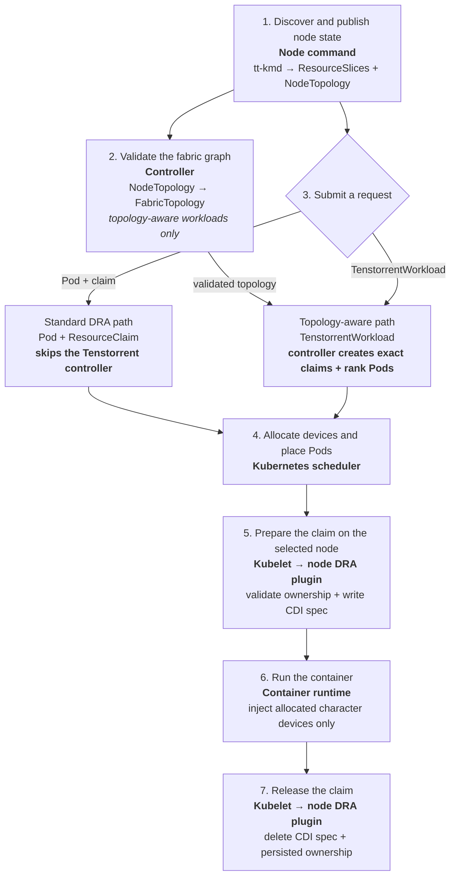

# System design

The current implementation provides exclusive, whole-card allocation. It runs
inside the QEMU `ttsim` Ubuntu guest and uses `tt-kmd` sysfs and character
devices as its hardware source of truth.

## Component responsibilities

| Component | Runs in | Responsibility |
| --- | --- | --- |
| `tt-kmd` hardware surface | QEMU `ttsim` guest | Exposes Tenstorrent character devices, identity, health, capabilities, PCI data, and fabric-link data. |
| `tt-dra-driver node`: inventory and publishers | Every enabled Kubernetes node | Discovers local hardware and publishes whole-card `ResourceSlice` objects plus that node's `TenstorrentNodeTopology`. |
| `tt-dra-driver controller`: topology reconciler | Kubernetes control plane | Validates fresh node topology observations and writes the cluster-wide `TenstorrentFabricTopology` status. |
| `tt-dra-driver controller`: workload reconciler | Kubernetes control plane | Handles only `TenstorrentWorkload` requests. It selects a connected device set and creates exact claims and hostname-constrained rank Pods. |
| Kubernetes scheduler | Kubernetes control plane | Allocates DRA devices and places Pods using `DeviceClass`, `ResourceSlice`, claim, and Pod constraints. |
| `tt-dra-driver node`: kubelet DRA plugin | Selected Kubernetes node | Revalidates allocated devices, enforces exclusive claim ownership, persists claim state, and creates per-claim CDI specs. |
| Kubelet and container runtime | Selected Kubernetes node | Ask the plugin to prepare or unprepare a claim and inject the returned CDI devices into the workload container. |
| Hardware Janitor | Planned; not implemented | Will reset and scrub devices, monitor active health, and taint or cordon unhealthy capacity. |

## System stages

Stages 1 and 2 run continuously. Stages 3 through 7 run for each workload. A
standard DRA request depends on published `ResourceSlice` data from stage 1 but
does not depend on the fabric graph or the Tenstorrent workload controller.

## Stage details

1. **Discover and publish node state.** The node command periodically discovers
   host-visible Tenstorrent character devices and their `tt-kmd`, PCI, health,
   capability, and fabric metadata. It does not use `tt-smi`. Each eligible
   character device is published as an exclusive whole-card DRA device in a
   node-owned `ResourceSlice`; eligible fabric endpoints and links are published
   in `TenstorrentNodeTopology`.
2. **Validate the fabric graph.** The controller combines fresh node topology
   objects into the cluster-scoped `TenstorrentFabricTopology` named `cluster`.
   Duplicate endpoints, stale observations, missing peers, asymmetric links,
   and cross-fabric or cross-ring links invalidate the graph for topology-aware
   workloads.
3. **Submit a request.** A standard Pod and `ResourceClaim` go directly to the
   native Kubernetes DRA path. For a `TenstorrentWorkload`, the controller
   selects a disjoint, connected device set on one node per rank, pins the
   assignment to the fabric generation, and creates an exact `ResourceClaim`
   and a hostname-constrained Pod for each rank. Assignments are replanned after
   a fabric change only before any rank starts; a started workload is instead
   reported as degraded.
4. **Allocate devices and place Pods.** The scheduler selects devices from
   `DeviceClass` and `ResourceSlice` data while scheduling each Pod. Exact claims
   created for a `TenstorrentWorkload` constrain this choice to the controller's
   topology-aware assignment.
5. **Prepare the claim.** On the selected node, kubelet calls the DRA plugin to
   prepare the allocated claim. The plugin refreshes local inventory, requires
   each allocated device to be local and healthy, prevents concurrent claim
   ownership, persists claim state, and writes a CDI spec containing only the
   allocated character-device nodes.
6. **Run the container.** Kubelet and the container runtime apply the returned
   CDI device IDs, exposing only the allocated character devices to the
   workload.
7. **Release the claim.** Unpreparing a claim removes its CDI spec and persisted
   ownership. Hardware reset, memory scrubbing, active fault recovery, and node
   tainting or cordoning are roadmap responsibilities of the Hardware Janitor
   and are not implemented by the current component.

## Scope boundaries

- Allocation is exclusive and whole-card; Tensix core groups, SRAM regions,
  and other fine-grained partitions are not exposed.
- Periodic inventory updates and prepare-time health validation are implemented.
  Active health remediation and pre-start ASIC scrubbing are not.
- The validation harness proves synthetic QEMU/kind discovery, publication, and
  CDI-backed allocation. Physical hardware certification is outside the
  repository's current validation scope.
