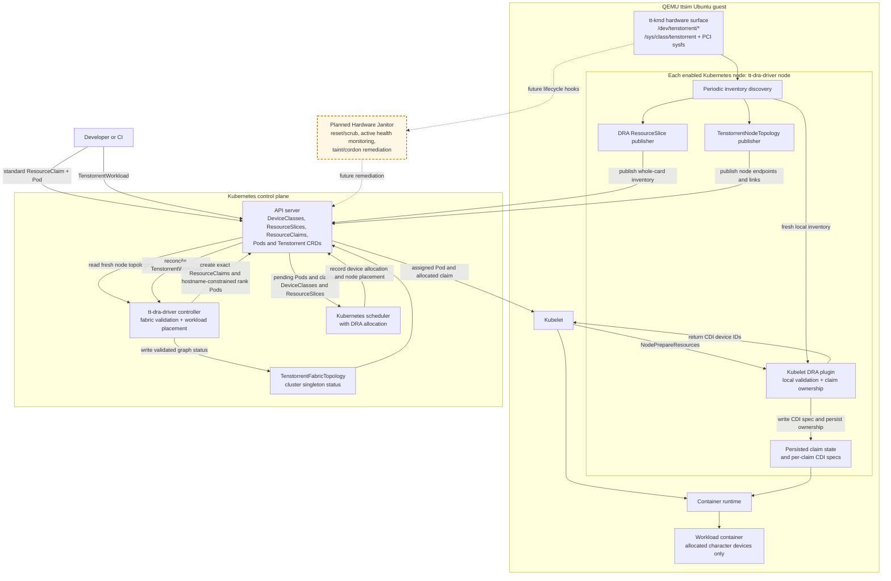

# System design

The current implementation provides exclusive, whole-card allocation. It runs
inside the QEMU `ttsim` Ubuntu guest and uses `tt-kmd` sysfs and character
devices as its hardware source of truth.

## Runtime flow

1. The node command periodically discovers host-visible Tenstorrent character
   devices and their `tt-kmd`, PCI, health, capability, and fabric metadata. It
   does not use `tt-smi`.
2. Each eligible character device is published as an exclusive whole-card DRA
   device in a node-owned `ResourceSlice`. The same node command publishes its
   eligible fabric endpoints and links in `TenstorrentNodeTopology`.
3. The controller combines fresh node topology objects into the cluster-scoped
   `TenstorrentFabricTopology` named `cluster`. Duplicate endpoints, stale
   observations, missing peers, asymmetric links, and cross-fabric or
   cross-ring links invalidate the graph for topology-aware workloads.
4. A standard Pod and `ResourceClaim` use the native Kubernetes DRA path and do
   not pass through the Tenstorrent workload controller. The scheduler selects
   devices from `DeviceClass` and `ResourceSlice` data while scheduling the Pod.
5. For a `TenstorrentWorkload`, the controller selects a disjoint, connected
   device set on one node per rank. It pins the assignment to the fabric
   generation, then creates an exact `ResourceClaim` and a hostname-constrained
   Pod for each rank. Assignments are replanned after a fabric change only
   before any rank starts; a started workload is instead reported as degraded.
6. On the selected node, kubelet calls the DRA plugin to prepare the allocated
   claim. The plugin refreshes local inventory, requires each allocated device
   to be local and healthy, prevents concurrent claim ownership, persists claim
   state, and writes a CDI spec containing only the allocated character-device
   nodes. Kubelet and the container runtime apply the returned CDI device IDs.
7. Unpreparing a claim removes its CDI spec and persisted ownership. Hardware
   reset, memory scrubbing, active fault recovery, and node tainting or
   cordoning are roadmap responsibilities of the Hardware Janitor and are not
   implemented by the current component.

## Scope boundaries

- Allocation is exclusive and whole-card; Tensix core groups, SRAM regions,
  and other fine-grained partitions are not exposed.
- Periodic inventory updates and prepare-time health validation are implemented.
  Active health remediation and pre-start ASIC scrubbing are not.
- The validation harness proves synthetic QEMU/kind discovery, publication, and
  CDI-backed allocation. Physical hardware certification is outside the
  repository's current validation scope.
