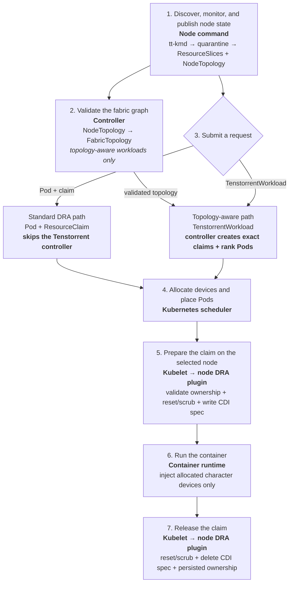

# System design

The current implementation provides exclusive, whole-card allocation. It runs
inside the QEMU `ttsim` Ubuntu guest and uses `tt-kmd` sysfs and character
devices as its hardware source of truth.

## Component responsibilities

| Component | Runs in | Responsibility |
| --- | --- | --- |
| `tt-kmd` hardware surface | QEMU `ttsim` guest | Exposes Tenstorrent character devices, identity, health, capabilities, PCI data, and fabric-link data. |
| `tt-dra-driver node`: inventory and publishers | Every enabled Kubernetes node | Discovers local hardware and publishes whole-card `ResourceSlice` objects plus that node's `TenstorrentNodeTopology`. |
| `tt-dra-driver controller`: topology reconciler | Kubernetes control plane | The elected replica validates informer-cached node topology observations and writes cluster-wide `TenstorrentFabricTopology` status. |
| `tt-dra-driver controller`: workload reconciler | Kubernetes control plane | Handles only `TenstorrentWorkload` requests. It selects a connected device set, creates exact claims and hostname-constrained rank Pods, and injects controller-owned rank environment. |
| Kubernetes scheduler | Kubernetes control plane | Allocates DRA devices and places Pods using `DeviceClass`, `ResourceSlice`, claim, and Pod constraints. |
| `tt-dra-driver node`: kubelet DRA plugin | Selected Kubernetes node | Revalidates allocated devices, enforces exclusive claim ownership, persists claim state, and creates per-claim CDI specs. |
| Kubelet and container runtime | Selected Kubernetes node | Ask the plugin to prepare or unprepare a claim and inject the returned CDI devices into the workload container. |
| Hardware Janitor | Node command | Resets and scrubs devices around claim use, quarantines unhealthy capacity, audits lifecycle decisions, and marks nodes with no healthy accelerator capacity. |

## System stages

Stages 1 and 2 run continuously. Stages 3 through 7 run for each workload. A
standard DRA request depends on published `ResourceSlice` data from stage 1 but
does not depend on the fabric graph or the Tenstorrent workload controller.

## Stage details

1. **Discover and publish node state.** The node command periodically discovers
   host-visible Tenstorrent character devices and their `tt-kmd`, PCI, health,
   capability, and fabric metadata. It does not use `tt-smi`. The Hardware
   Janitor quarantines unhealthy, missing, faulted, or fabric-disconnected
   devices and requires a dedicated IOMMU group by default. Only healthy,
   non-quarantined devices are published in ResourceSlices and node topology.
   If none remain, the node receives the
   `tenstorrent.com/accelerator-unhealthy:NoSchedule` taint and a false
   `TenstorrentAcceleratorsHealthy` condition.
2. **Validate the fabric graph.** The controller combines fresh node topology
   objects into the cluster-scoped `TenstorrentFabricTopology` named `cluster`.
   Duplicate endpoints, stale observations, missing peers, asymmetric links,
   and cross-fabric or cross-ring links invalidate the graph for topology-aware
   workloads.
3. **Submit a request.** A standard Pod and `ResourceClaim` go directly to the
   native Kubernetes DRA path. For a `TenstorrentWorkload`, the controller
   selects a disjoint, connected device set on one node per rank, pins the
   assignment to the fabric generation, and creates an exact `ResourceClaim`
   and a hostname-constrained Pod for each rank. Assignments are replanned after
   a fabric change only before any rank starts; a started workload is instead
   reported as degraded.
4. **Allocate devices and place Pods.** The scheduler selects devices from
   `DeviceClass` and `ResourceSlice` data while scheduling each Pod. Exact claims
   created for a `TenstorrentWorkload` constrain this choice to the controller's
   topology-aware assignment.
5. **Prepare the claim.** On the selected node, kubelet calls the DRA plugin to
   prepare the allocated claim. The plugin refreshes local inventory, prevents
   concurrent ownership, issues `tt-kmd` ASIC_RESET and POST_RESET ioctls,
   verifies that the device returned healthy, persists claim state, and writes a
   CDI spec containing only the allocated character-device nodes. A reset,
   verification, or audit failure quarantines the device and fails preparation.
6. **Run the container.** Kubelet and the container runtime apply the returned
   CDI device IDs, exposing only the allocated character devices to the
   workload.
7. **Release the claim.** Unpreparing a claim resets and scrubs every allocated
   device before removing its CDI spec and persisted ownership. Any failure
   retains ownership and quarantine so the device cannot be reused. The
   operation is retried by kubelet.

## Tenant-isolation contract

- CDI exposes only each claim's allocated character-device nodes, including the
  exact major and minor numbers used by the container runtime's device cgroup.
- Production mode requires each accelerator to be the sole member of an IOMMU
  group. A missing or shared group quarantines the device.
- Sanitization uses the `tt-kmd` RESET_DEVICE ioctl with ASIC_RESET followed by
  POST_RESET. This invalidates pre-reset mappings and is the whole-card scrub
  boundary. A platform that cannot certify that this reset clears tenant-visible
  accelerator state is unsupported.
- The node agent is a privileged host component because it must open the
  character devices and manage kubelet CDI/plugin paths. It does not protect
  devices from host root or other privileged workloads; those remain outside the
  Kubernetes tenant boundary.
- An active health failure, non-zero `fault_code` (including OOM or hang faults
  reported by `tt-kmd`), or fabric-link failure quarantines the device and
  removes it from new capacity. The janitor does not reset or evict a running
  claim. Ownership remains frozen until kubelet unprepares the claim, when
  post-use sanitization must succeed before release.
- Sanitization, quarantine, recovery, and claim decisions are appended as JSON
  lines to `/var/lib/tenstorrent-dra/audit.jsonl` with mode `0600`.

## Scope boundaries

- Allocation is exclusive and whole-card; Tensix core groups, SRAM regions,
  and other fine-grained partitions are not exposed.
- Periodic inventory updates, active health fencing, pre-start and post-use ASIC
  reset/scrubbing, quarantine, node safety state, and audit logging are
  implemented.
- Controller reconciliation is informer-driven, per-object rate limited, and
  leader elected across two replicas.
- The validation harness exercises synthetic QEMU/kind discovery, publication,
  native and topology-aware DRA allocation, CDI device isolation, lifecycle
  audit, cleanup, and reuse. Physical hardware certification remains explicit
  release-gate work in [`TODO.md`](../TODO.md).
