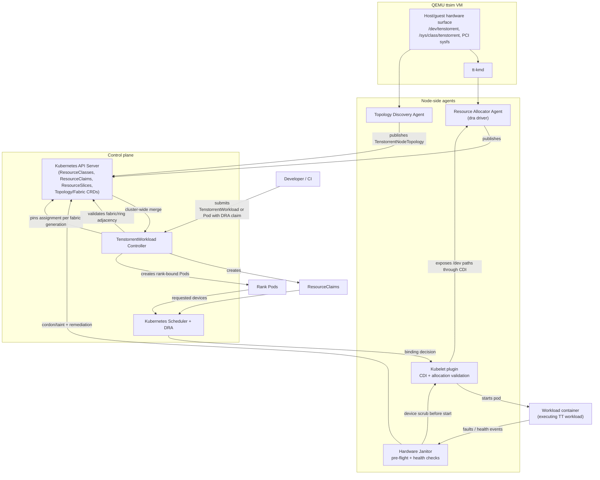

# Design illustration

## How the system operates

1. The Resource Allocator Agent discovers cards from `tt-kmd` and publishes whole-card inventory as `ResourceSlices` in Kubernetes (health, PCI/NUMA context, capacity, identity, and class attributes).
2. The Topology Discovery Agent publishes per-node fabric endpoints in `TenstorrentNodeTopology`; the controller combines these into cluster fabric visibility for ring/fabric-aware placement.
3. A workload controller receives `TenstorrentWorkload` (or claim-based) requests, selects disjoint devices that satisfy topology constraints, and creates exact `ResourceClaims`.
4. The scheduler binds rank pods to nodes; the kubelet plugin validates allocation and injects CDI device access in the container namespace.
5. The Hardware Janitor performs pre-flight scrubbing and continuous health checks; faults trigger tainting/cordoning and reassessment of dependent workloads.
